# PTMatch

> 사용자와 트레이너를 연결하는 PT 매칭 플랫폼

[PTMatch 바로가기](https://ptmatch.shop)

<br>

## 목차

- [PTMatch](#ptmatch)
  - [목차](#목차)
  - [1. 프로젝트 소개](#1-프로젝트-소개)
  - [2. 기술 스택](#2-기술-스택)
    - [Backend](#backend)
    - [Database](#database)
    - [Infra / DevOps](#infra--devops)
  - [3. 시스템 아키텍처](#3-시스템-아키텍처)
  - [4. 주요 기능](#4-주요-기능)
  - [5. ERD](#5-erd)
  - [6. 패키지 구조](#6-패키지-구조)
  - [7. API 명세](#7-api-명세)
  - [8. 기술적 의사결정](#8-기술적-의사결정)


## 1. 프로젝트 소개

PTMatch는 사용자(회원)와 트레이너 간 PT 매칭을 중개하는 플랫폼입니다.
사용자는 지도 기반 검색으로 근처 트레이너를 탐색하고, 원하는 일정을 선택해 매칭을 신청할 수 있습니다.

**핵심 기능 요약**

- 지도 기반 트레이너 탐색 (PostGIS + S2 Geometry 공간 쿼리)
- 트레이너-사용자 매칭 요청 및 수락/거절
- 매칭 수락 후 WebSocket 1:1 채팅
- Toss Payments 연동 결제
- Spring Batch 기반 트레이너 월별 통계 집계
- Prometheus + Grafana + Loki + Tempo 모니터링 스택


## 2. 기술 스택

### Backend

| 분류               | 기술                             |
| ------------------ | -------------------------------- |
| Language / Runtime | Java 17                          |
| Framework          | Spring Boot 3.5                  |
| ORM                | Spring Data JPA (Hibernate)      |
| Security           | Spring Security, JWT (jjwt 0.11) |
| Real-time          | Spring WebSocket + STOMP         |
| Batch              | Spring Batch                     |
| Cache              | Redis, Caffeine                  |
| Storage            | MinIO (S3 호환)                  |
| API Docs           | SpringDoc OpenAPI (Swagger UI)   |
| Retry              | Spring Retry                     |

### Database

| 분류        | 기술                 |
| ----------- | -------------------- |
| RDBMS       | PostgreSQL + PostGIS |
| 공간 인덱싱 | S2 Geometry Library  |
| Cache       | Redis                |

### Infra / DevOps

| 분류       | 기술                                            |
| ---------- | ----------------------------------------------- |
| Container  | Docker, Docker Compose                          |
| Web Server | Nginx (Reverse Proxy + SSL)                     |
| DNS        | Cloudflare                                      |
| CI/CD      | GitHub Actions                                  |
| Monitoring | Prometheus, Grafana, Loki, Tempo, OpenTelemetry |


## 3. 시스템 아키텍처

<!-- 아키텍처 다이어그램 이미지를 여기에 삽입해주세요 -->
<!--  -->

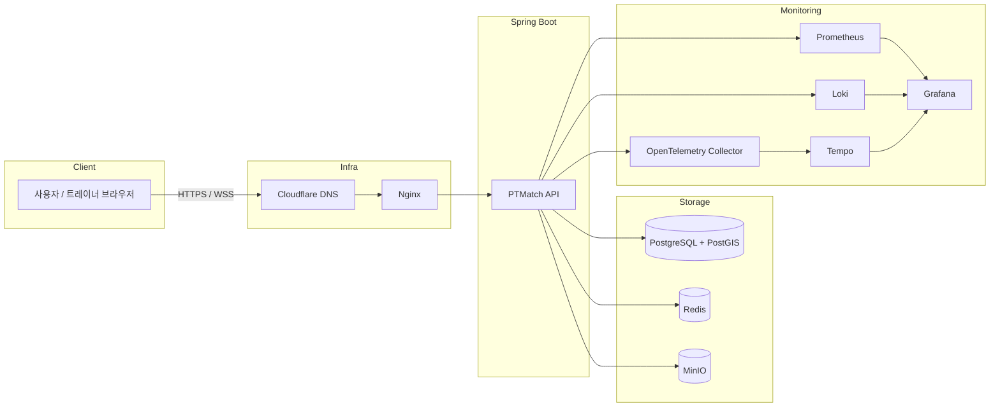


## 4. 주요 기능

<details>
<summary>🏠 메인 페이지</summary>

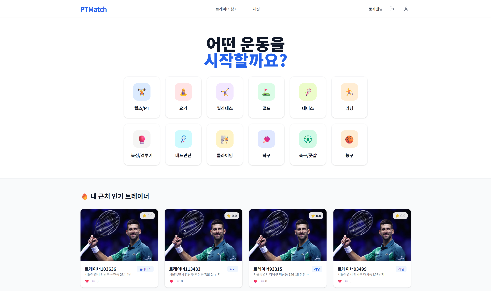

</details>

<details>
<summary>🗺️ 지도 기반 트레이너 탐색</summary>

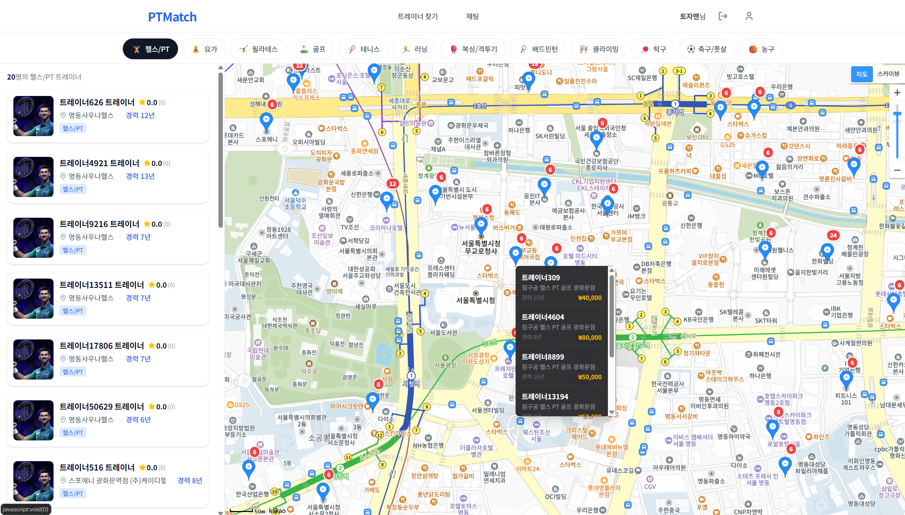
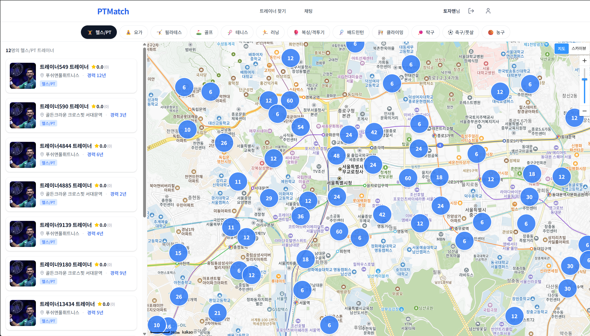

- S2 Geometry Cell 사전 필터링으로 쿼리 성능 최적화
- 지도 마커 클러스터링 + 지역 기반 목록 조회 API

</details>

<details>
<summary> 🚴 트레이너 상세 페이지</summary>

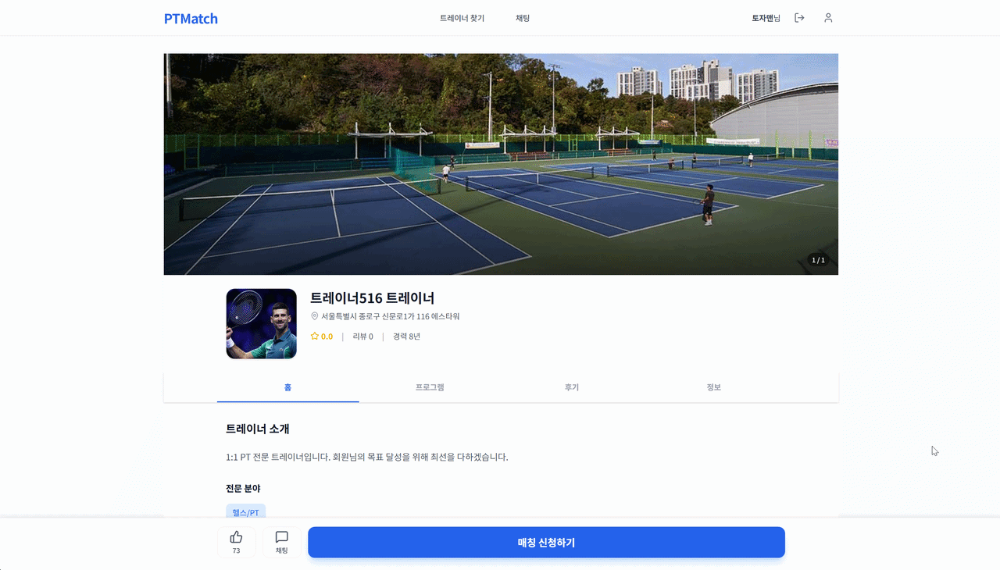

</details>

<details>
<summary>🤝 매칭</summary>

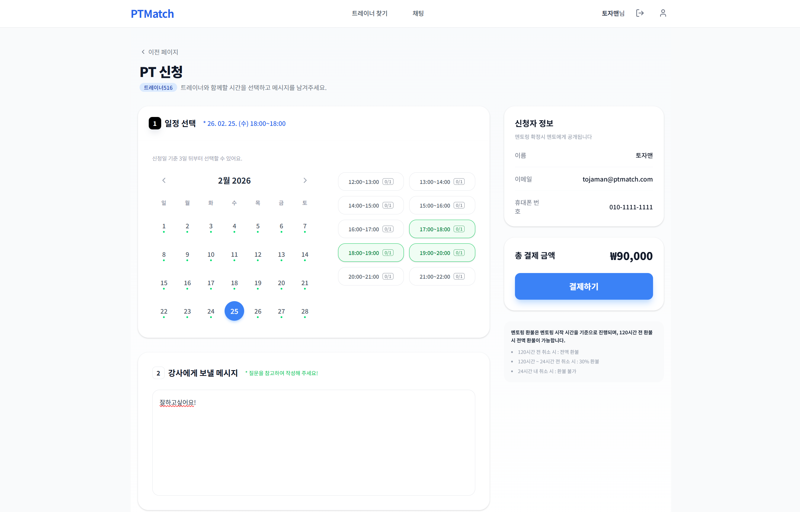

- 사용자가 트레이너의 가용 일정을 선택해 매칭 요청
- 트레이너 수락/거절 → 상태 전이 관리

</details>

<details>
<summary>💳 결제</summary>

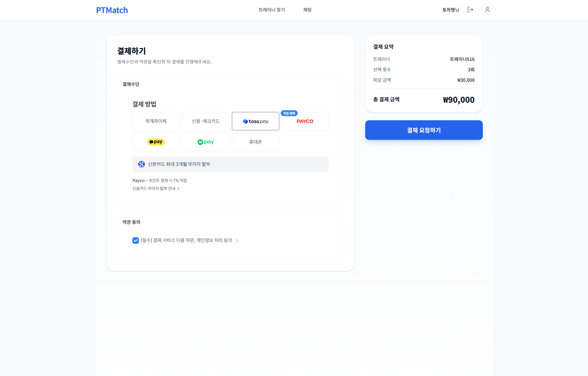
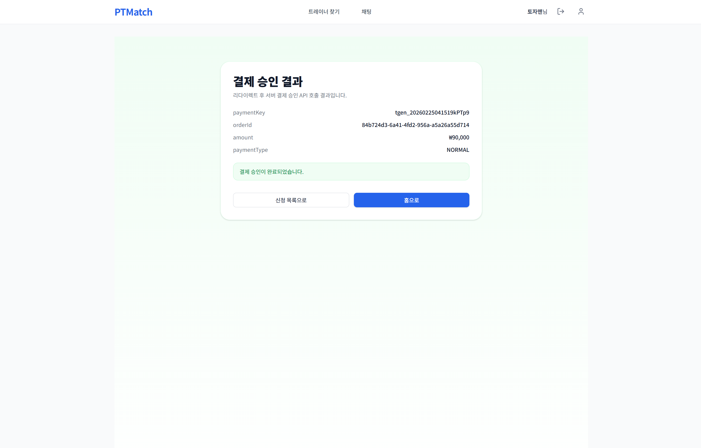

- Toss Payments 위젯 연동 (prepare → confirm 2단계)
- 금액 위변조 방지 이중 검증 (DB 저장 금액 vs Toss 응답 금액)
- 상태 기반 보상 트랜잭션 (결제 실패 시 스케줄/매칭 롤백)
- 재조정 스케줄러 (UNKNOWN 상태 주문 자동 재조회)
- 만료 스케줄러 (TTL 초과 주문 자동 EXPIRED 처리)

</details>

<details>
<summary>📊 통계</summary>

일 대시보드
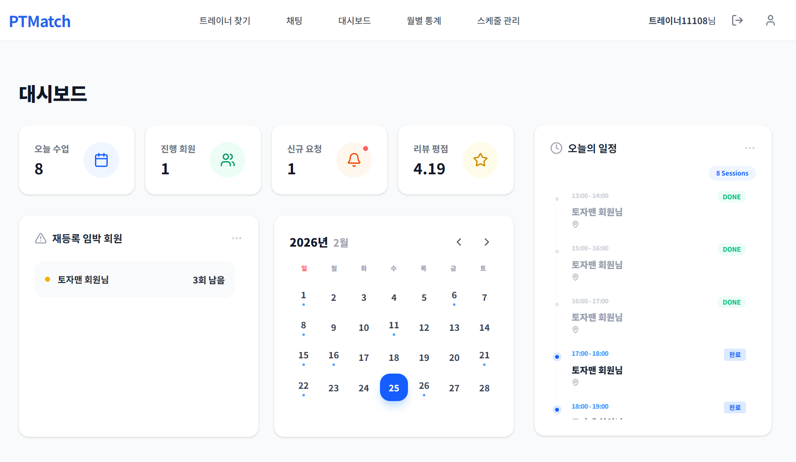

월 통계 대시보드
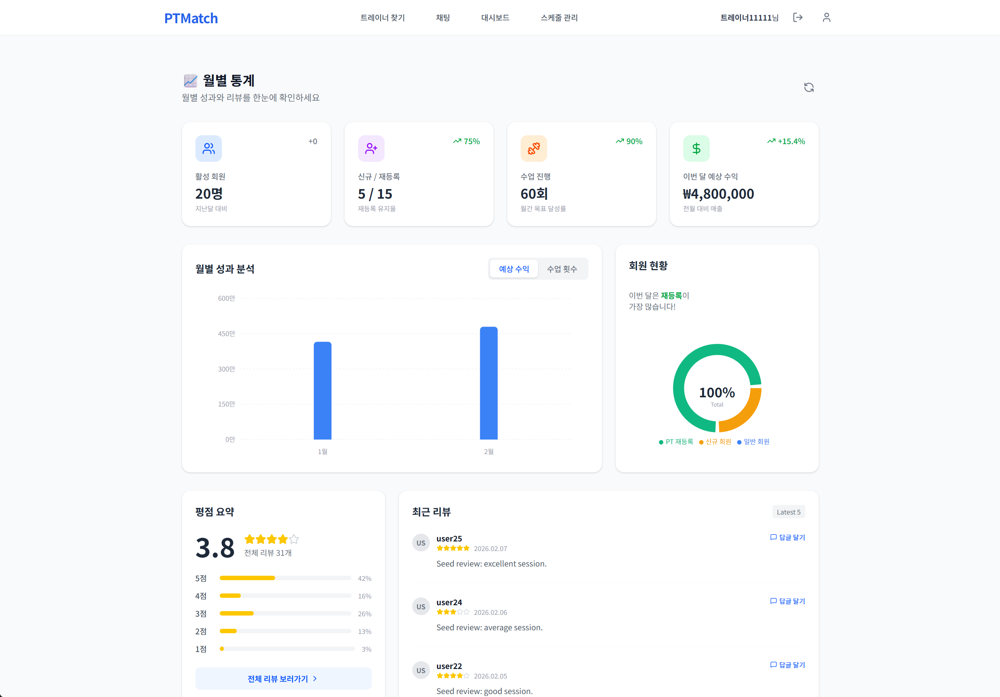

- Spring Batch 기반 트레이너 월별 매칭/결제 통계 집계

</details>

<details>
<summary>🔐 인증 / 인가</summary>

- JWT Access Token + Refresh Token 토큰 방식
- Refresh Token은 Redis에 저장하여 TTL 기반 자동 만료
- Spring Security 기반 ROLE_USER / ROLE_TRAINER 권한 분리

</details>

<details>
<summary>💬 채팅</summary>

- WebSocket + STOMP 프로토콜 실시간 메시지 송수신
- Redis Pub/Sub 기반 멀티 인스턴스 fan-out 지원

</details>

## 5. ERD

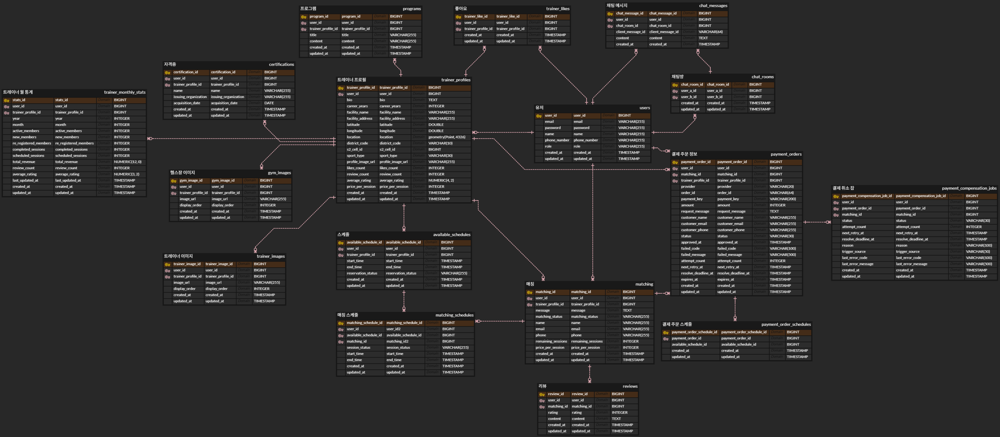


## 6. 패키지 구조

```
PT_Match/
├── src/main/java/com/solo/ptmatch/
│   ├── chat/               # 채팅 (WebSocket, 메시지, 채팅방)
│   ├── common/             # 공통 (설정, 예외, 응답 포맷, 보안)
│   ├── location/           # 위치 (행정구역 데이터)
│   ├── matching/           # 매칭 (요청, 수락, 스케줄)
│   ├── payment/            # 결제 (Toss 연동, 보상 트랜잭션, 스케줄러)
│   │   ├── presentation/   # PaymentController, request/response DTO
│   │   ├── application/    # PaymentPrepareService, PaymentConfirmService, PaymentConfirmTxService
│   │   ├── domain/         # PaymentOrder, PaymentStatus, PaymentProvider
│   │   ├── infrastructure/ # PaymentOrderRepository, Toss API 클라이언트, 설정
│   │   └── scheduler/      # PaymentReconcileScheduler, PaymentExpireScheduler
│   ├── review/             # 리뷰
│   ├── statistics/         # 통계 (Spring Batch)
│   ├── trainer/            # 트레이너 프로필, 지도 검색
│   └── user/               # 사용자, 인증 (JWT)
│
├── frontend/               # React + TypeScript + Vite
└── docker-compose.yml
```

## 7. API 명세

Swagger UI에서 전체 API를 확인할 수 있습니다.

> 로컬: http://ptmatch.shop/swagger-ui.html

## 8. 기술적 의사결정
